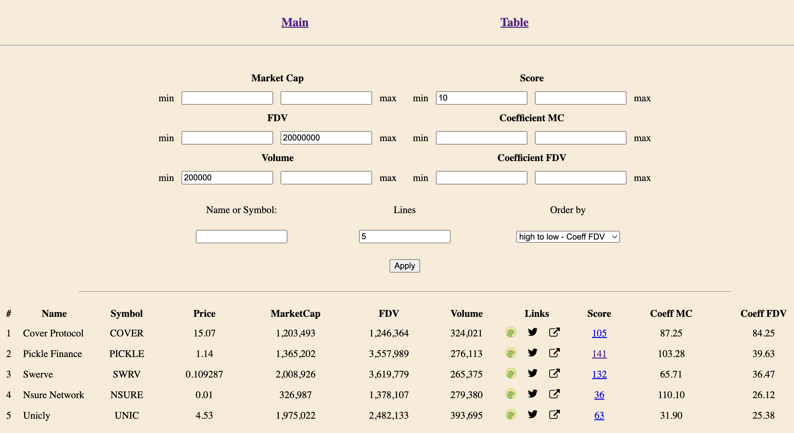

You can try the service here - http://65.109.169.213:24360/stat/

Logic:
Using TwitterScore we can get a score of a Twitter account. Different projects and coins have different score, score reflects how many "active or strong" people follow it. And it would be great to have such statistic for all coins and analyze it.

Knowing info from CoinMarketCap or Coingecko we can filter all projects with big score and small market cap and check it manually for the activity. That helps to filter interesting project for further research. That's not a tool for no-brain buy.

Coefficient MC - score / market cap

Coefficient FDV - score / FDV

The higher score - the better ratio. It's useful also for filter tokens by market cap (min 1m/10m), volume (100k) etc..

That's just a tool, nothing more. NFA, DYOR etc... 

How it looks:
